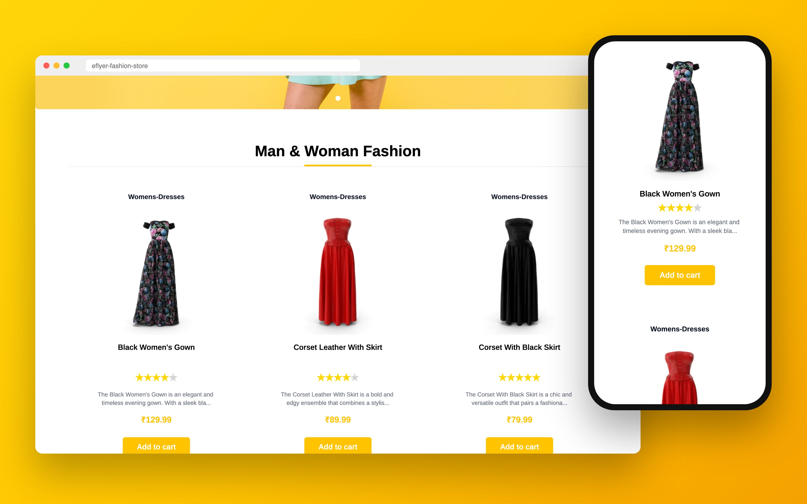
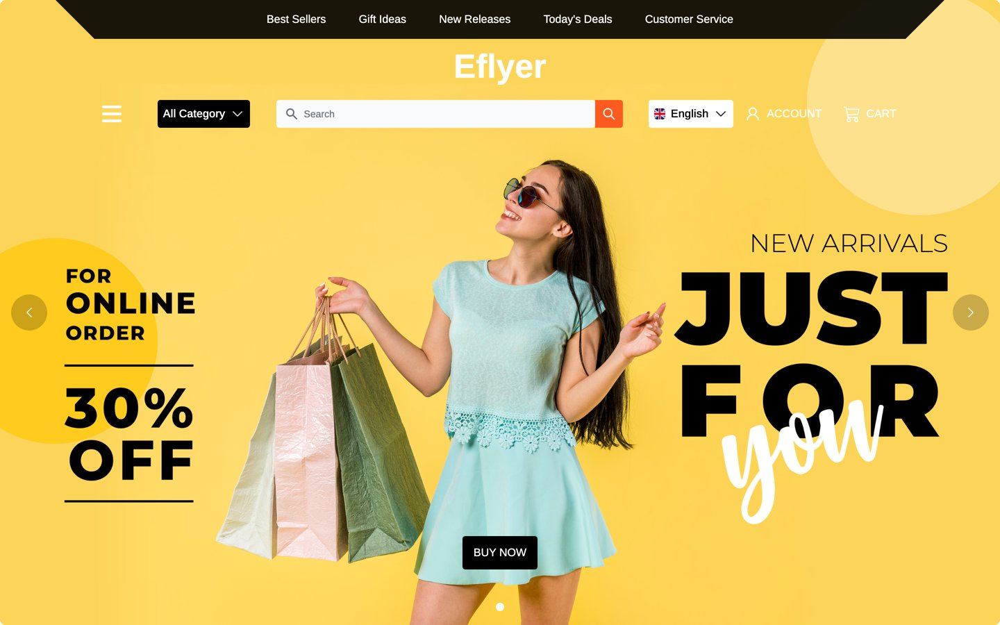
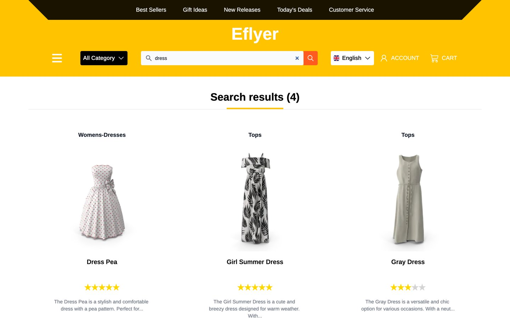
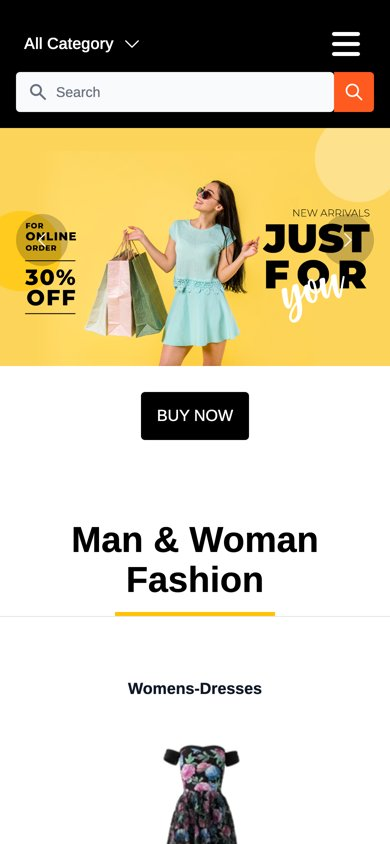

# eFlyer: Fashion Store

A responsive fashion e-commerce storefront built with **React, Redux Toolkit and Tailwind CSS**. Product data comes from the free [DummyJSON](https://dummyjson.com) API.



## Features

- **Product catalog:** men's and women's fashion loaded from a public API, shown in product cards with ratings and prices
- **Search:** search products by name from the navbar
- **Categories:** browse dresses, tops, shirts, bags, shoes, watches and more
- **Hero carousel** with promo banners
- **Responsive layout** for mobile and desktop
- **Protected routes** for account pages

## Screenshots

| Home | Search |
|---|---|
|  |  |



## Tech stack

React 18 · Redux Toolkit (`createAsyncThunk`) · React Router 6 · Tailwind CSS · Axios

## How it works

- **`features/items/api.js`:** async thunks for products, a single product and categories. API responses are mapped to one product shape, so the UI doesn't depend on the API format.
- **`features/items/itemSlice.js`:** a Redux slice with loading and error states, plus client-side search.
- **`pages/`:** Home and Search. **`components/`:** navbar, product card, loader, footer.

## Run locally

```bash
npm install
npm start
```

No API key is needed. To use a different backend, set `REACT_APP_API_URL`.
