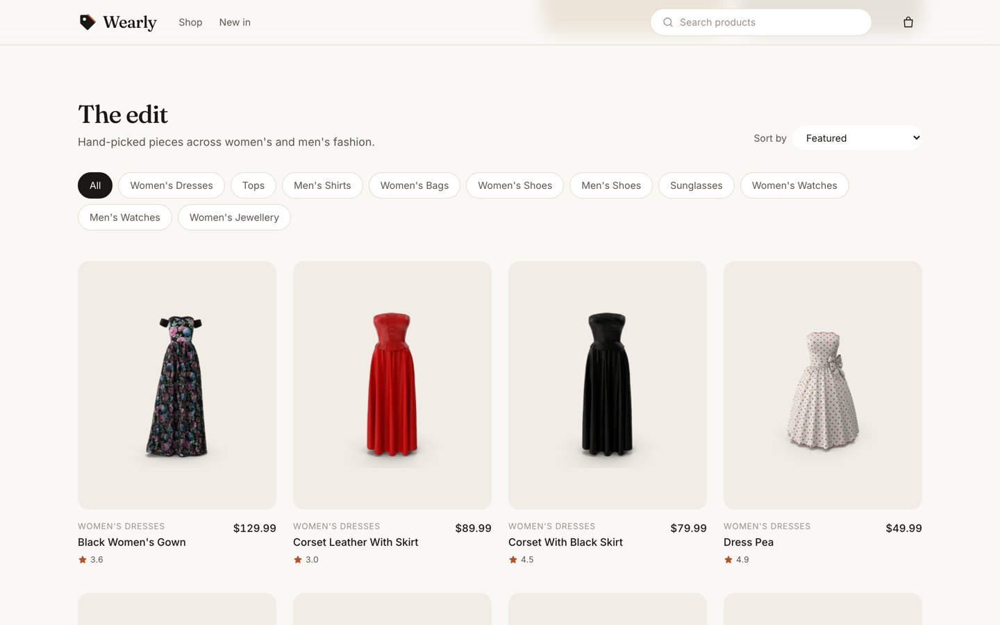
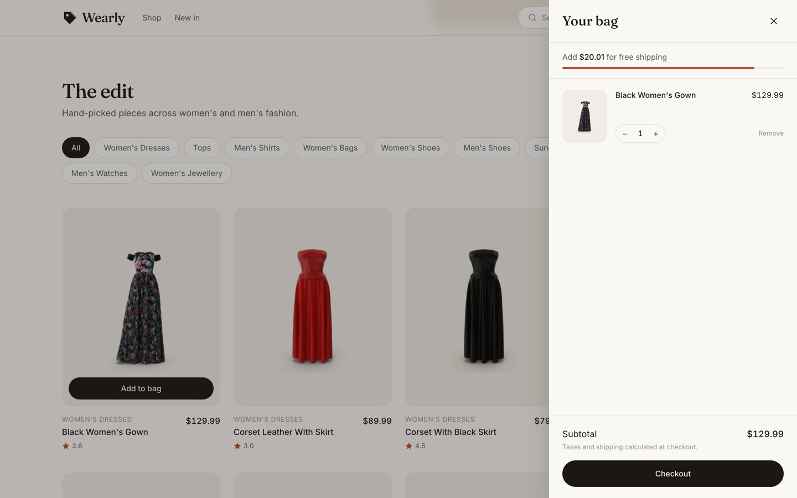

# Wearly

A modern fashion storefront built with **React, Redux Toolkit and Tailwind CSS**. Browse a curated catalog, filter and sort it, search for products and manage a shopping bag. Product data comes from the free [DummyJSON](https://dummyjson.com) API.


## Features

- **Catalog:** category filters, sorting by price or rating, and a responsive product grid
- **Search:** search products by name from the header
- **Shopping bag:** slide-out drawer with quantity controls, subtotal and a free-shipping progress bar. Saved across reloads.
- **Loading and empty states:** skeleton loaders, a retry on error, and "nothing found" states
- **Accessible UI:** keyboard support (Esc closes the bag), visible focus rings, ARIA labels and reduced-motion support
- **Responsive:** a 2-column grid and scrollable filter chips on mobile

## Screenshots

| Home | Catalog |
|---|---|
|  |  |

| Shopping bag | Search |
|---|---|
|  |  |


## Design

- **Type:** Fraunces (serif) for headings, Inter for UI and body text
- **Color:** warm off-white, ink and one rust accent, defined as Tailwind theme tokens
- **Logo:** a price-tag mark, drawn as an inline SVG

## Tech stack

React 18 · Redux Toolkit · React Router 6 · Tailwind CSS · Axios

## Structure

```
src/
├── features/
│   ├── items/      # product thunks (createAsyncThunk) and slice
│   └── cart/       # cart slice, persisted to localStorage
├── components/     # Navbar, Hero, Catalog, ProductCard, CartDrawer, Logo
├── pages/          # Home, Search
├── utils/          # price and category formatting, sort options
└── brand.js        # store name and tagline
```

- API responses are mapped to a single product shape in `features/items/api.js`, so the UI doesn't depend on the API format.
- Filtering and sorting are derived with `useMemo`, so nothing is duplicated in the Redux store.

## Run locally

```bash
npm install
npm start
```

No API key is needed. To use another backend, set `REACT_APP_API_URL`.
